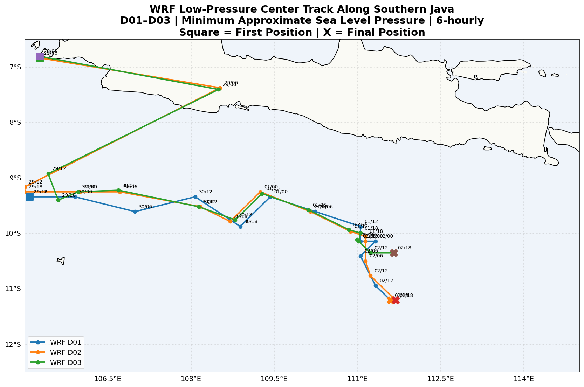

# Simulasi Numerik Siklon Tropis Dahlia (2017) Menggunakan Model WRF-ARW v4.3


---

## 📖 Deskripsi Repository

Repository ini mendokumentasikan proses **simulasi numerik Siklon Tropis Dahlia (2017)** menggunakan **Weather Research and Forecasting (WRF-ARW) versi 4.3** dengan data **ERA5 Reanalysis** sebagai kondisi awal (*initial condition*) dan kondisi batas (*boundary condition*).

Dokumentasi mencakup seluruh tahapan mulai dari persiapan lingkungan kerja menggunakan Docker, konfigurasi domain, preprocessing menggunakan **WPS**, pelaksanaan simulasi **WRF**, hingga visualisasi dan validasi hasil terhadap data observasi **MSWEP**.

Repository ini dibuat sebagai dokumentasi selama kegiatan magang di **Badan Riset dan Inovasi Nasional (BRIN)** sekaligus sebagai referensi bagi pengguna yang ingin melakukan simulasi kasus nyata menggunakan WRF.

---

# 📑 Daftar Isi

- [Latar Belakang](#-latar-belakang)
- [Workflow Simulasi](#-workflow-simulasi)
- [Persyaratan Sistem](#-persyaratan-sistem)
- [Persiapan Docker](#-persiapan-docker)
- [Konfigurasi Domain](#-konfigurasi-domain)
- [Data Input](#-data-input)
- [Menjalankan WPS](#-menjalankan-wps)
- [Menjalankan WRF](#-menjalankan-wrf)
- [Hasil Simulasi](#-hasil-simulasi)
- [Validasi Hasil](#-validasi-hasil)
- [Troubleshooting](#-troubleshooting)
- [Referensi](#-referensi)

---

# 🌎 Latar Belakang

## Weather Research and Forecasting (WRF)

**Weather Research and Forecasting (WRF)** merupakan model numerik atmosfer mesoskal yang banyak digunakan untuk penelitian maupun prakiraan cuaca operasional. Model ini mampu mensimulasikan berbagai fenomena atmosfer, mulai dari sistem cuaca lokal hingga fenomena berskala besar seperti siklon tropis.

Pada repository ini digunakan **WRF-ARW v4.3** dengan data **ERA5 Reanalysis** sebagai kondisi awal dan kondisi batas simulasi.

## Siklon Tropis Dahlia

Siklon Tropis Dahlia merupakan siklon tropis yang terbentuk di Samudra Hindia pada akhir November 2017, tidak lama setelah melemahnya Siklon Tropis Cempaka. Meskipun pusat siklon berada di luar wilayah Indonesia, sistem ini memberikan pengaruh yang cukup signifikan terhadap kondisi cuaca di berbagai wilayah, khususnya Pulau Jawa, Sumatera bagian selatan, serta perairan di Samudra Hindia.

Keberadaan Siklon Tropis Dahlia meningkatkan suplai uap air dan memperkuat konvergensi massa udara sehingga memicu **curah hujan lebat**, **angin kencang**, dan **gelombang laut tinggi** di sejumlah wilayah Indonesia. Dampak hidrometeorologi yang dilaporkan antara lain meliputi **banjir**, **tanah longsor**, **genangan**, pohon tumbang akibat angin kencang, serta terganggunya aktivitas pelayaran karena tinggi gelombang yang meningkat.

Penelitian ini bertujuan merekonstruksi kejadian tersebut menggunakan model WRF sehingga hasil simulasi dapat dibandingkan dengan data observasi satelit.

> 📌 **Referensi BMKG**
>
> - https://www.bmkg.go.id/siaran-pers/cempaka-meluruh-dahlia-lahir-waspada-bencana-hidrometeorologi-menghadang
> - https://bbmkg3.bmkg.go.id/bbmkg3_pdf_files/11122017060450.pdf

---

# 🔄 Workflow Simulasi

```text
ERA5 Reanalysis
        │
        ▼
WRF Domain Wizard
        │
        ▼
WPS
 ├── geogrid.exe
 ├── ungrib.exe
 └── metgrid.exe
        │
        ▼
real.exe
        │
        ▼
wrf.exe
        │
        ▼
wrfout
        │
        ▼
Visualisasi
        │
        ▼
Validasi (MSWEP)
```

---

# 💻 Persyaratan Sistem

## Software yang Digunakan

| Software | Versi |
|----------|--------|
| Docker Desktop | Latest |
| Docker Image | dtcenter/wps_wrf |
| WRF | v4.3 |
| WPS | v4.3 |
| Python | 3.x |
| Google Colab | Latest |
| QGIS | 3.x (Opsional) |

## Hardware yang Disarankan

| Komponen | Minimum |
|----------|---------|
| Processor | Intel Core i5 / Ryzen 5 |
| RAM | 16 GB |
| Storage | ≥100 GB |
| Sistem Operasi | Windows 10 / Windows 11 |

---

# 🐳 Persiapan Docker

## 1. Pull Docker Image

```bash
docker pull dtcenter/wps_wrf
```

```bash
docker images
```

## 2. Menjalankan Docker Container

```bash
docker ps
docker exec -it <container_id> /bin/bash
```

## 3. Direktori Kerja

```text
/comsoftware/wrf
```

```text
comsoftware/
└── wrf/
    ├── WPS-4.3/
    ├── WRF-4.3/
    ├── WPS_GEOG/
    └── data_era5/
```

---

# 🌍 Konfigurasi Domain

| Domain | Resolusi | Grid | Cakupan |
|---------|---------|---------|----------------|
| D01 | 30 km | 170 × 170 | Regional |
| D02 | 9 km | 190 × 175 | Jawa Bagian Tengah |
| D03 | 3 km | 250 × 220 | Wilayah Studi |

## Konfigurasi Domain

<p align="center">

</p>

> 📌 **Gambar di atas menunjukkan konfigurasi tiga domain simulasi yang dibuat menggunakan WRF Domain Wizard.**

# 📥 Data Input

Simulasi menggunakan data **ERA5 Reanalysis** sebagai kondisi awal (*Initial Condition*) dan kondisi batas (*Boundary Condition*). Seluruh data diunduh dengan resolusi temporal 1 jam untuk periode simulasi **26–29 November 2017**.

---

## Dataset yang Digunakan

| Jenis Data | Produk | Keterangan |
|------------|--------|------------|
| Pressure Levels | ERA5 Pressure Level | Kondisi atmosfer tiga dimensi |
| Surface Levels | ERA5 Single Level | Variabel permukaan seperti T2, U10, V10, dan PSFC |
| Geographical Data | WPS_GEOG | Data topografi dan penggunaan lahan |

---

## Struktur Folder

```text
/comsoftware/wrf
├── data_era5
│   ├── ERA5_PL/
│   └── ERA5_SFC/
├── WPS-4.3/
└── WPS_GEOG/
```

---

# 🗺️ Data Geografis (WPS_GEOG)

Sebelum menjalankan WPS, pastikan dataset geografis telah tersedia pada direktori **WPS_GEOG**.

Contoh pengecekan:

```bash
cd /comsoftware/wrf/WPS_GEOG

ls
```

Apabila data belum tersedia, ekstrak dataset ke direktori tersebut.

---

# ⚙️ Menjalankan WPS

Masuk ke direktori WPS.

```bash
cd /comsoftware/wrf/WPS-4.3
```

Pastikan file berikut tersedia.

```text
geogrid.exe
ungrib.exe
metgrid.exe
link_grib.csh
```

---

# 📝 Konfigurasi namelist.wps

Sesuaikan parameter simulasi pada file `namelist.wps`.

```bash
vi namelist.wps
```

Contoh konfigurasi utama:

```text
&share
 wrf_core = 'ARW',
 max_dom = 3,

 start_date = '2017-11-29_00:00:00','2017-11-29_00:00:00','2017-11-29_00:00:00',

 end_date   = '2017-12-02_23:00:00','2017-12-02_23:00:00','2017-12-02_23:00:00',

 interval_seconds = 3600,
/

&geogrid
 parent_id         = 1,   1,   2,
 parent_grid_ratio = 1,   3,   3,

 i_parent_start    = 1,   30,  35,
 j_parent_start    = 1,   25,  30,

 e_we              = 150, 220, 232,
 e_sn              = 130, 214, 214,

 geog_data_res     = 'default','default','default',

 dx = 27000,
 dy = 27000,

 map_proj = 'mercator',
 ref_lat  = -8.5,
 ref_lon  = 109.5,
 truelat1 = -8.5,
 stand_lon = 109.5,

 geog_data_path = '/comsoftware/wrf/WPS_GEOG'
/

&ungrib
 out_format = 'WPS',
 prefix = 'ERA5'
/

&metgrid
 fg_name = 'ERA5',
 io_form_metgrid = 2,
/
```

> 📌 Gunakan konfigurasi `namelist.wps` lengkap sesuai proyek simulasi Anda.

---

# 🌍 Menjalankan geogrid

Program **geogrid.exe** menghasilkan data geografis untuk setiap domain simulasi.

```bash
./geogrid.exe
```

Periksa prosesnya melalui log.

```bash
cat geogrid.log
```

Output yang diharapkan:

```text
Successful completion of program geogrid.exe
```

---

# 🌦️ Menjalankan ungrib

Hubungkan terlebih dahulu data ERA5 dengan WPS.

```bash
./link_grib.csh /comsoftware/wrf/data_era5/ERA5_PL/*
./link_grib.csh /comsoftware/wrf/data_era5/ERA5_SFC/*
```

Pastikan Vtable telah dipilih.

```bash
ln -sf ungrib/Variable_Tables/Vtable.ERA5 Vtable
```

Kemudian jalankan:

```bash
./ungrib.exe
```

Periksa log:

```bash
cat ungrib.log
```

Output yang diharapkan:

```text
Successful completion of program ungrib.exe
```

---

# 🛰️ Menjalankan metgrid

Tahap terakhir preprocessing adalah menggabungkan data meteorologi dengan data geografis.

```bash
./metgrid.exe
```

Periksa hasilnya.

```bash
cat metgrid.log
```

Output yang diharapkan:

```text
Successful completion of program metgrid.exe
```

Setelah selesai akan terbentuk file:

```text
met_em.d01.*
met_em.d02.*
met_em.d03.*
```

File inilah yang selanjutnya digunakan pada proses **real.exe** di WRF.

# 🚀 Menjalankan WRF

Setelah seluruh proses **WPS** selesai dan file `met_em.d0*.nc` berhasil dibuat, tahap berikutnya adalah menjalankan model **WRF-ARW**.

---

# 📂 Struktur Direktori WRF

Masuk ke direktori WRF.

```bash
cd /comsoftware/wrf/WRF-4.3/run
```

Pastikan file berikut tersedia.

```text
real.exe
wrf.exe
namelist.input
met_em.d01.*
met_em.d02.*
met_em.d03.*
```

---

# 📝 Konfigurasi namelist.input

Buka file konfigurasi.

```bash
nano namelist.input
```
Contoh konfigurasi utama:

```text
&time_control
 run_days                            = 3,
 run_hours                           = 23,
 run_minutes                         = 0,
 run_seconds                         = 0,

 start_year                          = 2017, 2017, 2017,
 start_month                         = 11,   11,   11,
 start_day                           = 29,   29,   29,
 start_hour                          = 00,   00,   00,

 end_year                            = 2017, 2017, 2017,
 end_month                           = 12,   12,   12,
 end_day                             = 02,   02,   02,
 end_hour                            = 23,   23,   23,

 interval_seconds                    = 3600,

 input_from_file                     = .true., .true., .true.,

 history_interval                    = 60, 60, 60,
 frames_per_outfile                  = 1, 1, 1,

 restart                             = .false.,
 restart_interval                    = 60,

 io_form_history                     = 2,
 io_form_restart                     = 2,
 io_form_input                       = 2,
 io_form_boundary                    = 2,

 auxinput4_inname                    = "wrflowinp_d<domain>",
 auxinput4_interval                  = 60, 60, 60,
 io_form_auxinput4                   = 2,

 debug_level                         = 0,
/

&domains
 time_step                           = 150,
 time_step_fract_num                 = 0,
 time_step_fract_den                 = 1,

 max_dom                             = 3,

 e_we                                = 150, 220, 232,
 e_sn                                = 130, 214, 214,

 e_vert                              = 60, 60, 60,

 p_top_requested                     = 10000,

 num_metgrid_levels                  = 38,
 num_metgrid_soil_levels             = 4,

 dx                                  = 27000,
 dy                                  = 27000,

 grid_id                             = 1, 2, 3,
 parent_id                           = 1, 1, 2,

 i_parent_start                      = 1, 30, 35,
 j_parent_start                      = 1, 25, 30,

 parent_grid_ratio                   = 1, 3, 3,
 parent_time_step_ratio              = 1, 3, 3,

 feedback                            = 1,
 smooth_option                       = 0,
/

&physics
 mp_physics                          = 2, 2, 2,
 ra_lw_physics                       = 4, 4, 4,
 ra_sw_physics                       = 4, 4, 4,

 radt                                = 27, 9, 3,

 sf_sfclay_physics                   = 1, 1, 1,
 sf_surface_physics                  = 2, 2, 2,

 bl_pbl_physics                      = 1, 1, 1,
 bldt                                = 0, 0, 0,

 cu_physics                          = 2, 2, 0,
 cudt                                = 5, 5, 0,

 isfflx                              = 1,
 ifsnow                              = 1,
 icloud                              = 1,

 surface_input_source                = 3,

 num_soil_layers                     = 4,

 sst_update                          = 1,

 sf_urban_physics                    = 0, 0, 0,
/

&fdda
/

&dynamics
 w_damping                           = 1,

 diff_opt                            = 1, 1, 1,
 km_opt                              = 4, 4, 4,

 diff_6th_opt                        = 0, 0, 0,
 diff_6th_factor                     = 0.12, 0.12, 0.12,

 base_temp                           = 290.,

 damp_opt                            = 3,
 zdamp                               = 5000., 5000., 5000.,
 dampcoef                            = 0.2, 0.2, 0.2,

 khdif                               = 0, 0, 0,
 kvdif                               = 0, 0, 0,

 non_hydrostatic                     = .true., .true., .true.,

 moist_adv_opt                       = 1, 1, 1,
 scalar_adv_opt                      = 1, 1, 1,

 gwd_opt                             = 1, 0, 0,
/

&bdy_control
 spec_bdy_width                      = 5,
 specified                           = .true., .false., .false.,
 nested                              = .false., .true., .true.,
/

&grib2
/

&namelist_quilt
 nio_tasks_per_group                 = 0,
 nio_groups                          = 1,
/
/
```

> 📌 Pada repository ini digunakan konfigurasi `namelist.input` untuk simulasi Siklon Tropis Dahlia periode November 2017. Salin konfigurasi lengkap yang digunakan pada proyek ke bagian ini.

---

# ▶️ Menjalankan real.exe

Program `real.exe` akan menghasilkan file kondisi awal (`wrfinput`) dan kondisi batas (`wrfbdy`) berdasarkan output WPS.

```bash
./real.exe
```

Apabila ingin menyimpan log:

```bash
./real.exe 2>&1 | tee LOGS/run_real.log
```

Periksa log:

```bash
tail -50 rsl.error.0000
```

Output yang diharapkan:

```text
SUCCESS COMPLETE REAL_EM INIT
```

File yang dihasilkan:

```text
wrfinput_d01
wrfinput_d02
wrfinput_d03
wrfbdy_d01
```

---

# 🌤️ Menjalankan wrf.exe

Setelah `real.exe` selesai tanpa error, jalankan simulasi utama.

```bash
./wrf.exe
```

Atau simpan log proses:

```bash
./wrf.exe 2>&1 | tee LOGS/run_wrf.log
```

Periksa proses simulasi:

```bash
tail -50 rsl.error.0000
```

Output akhir yang diharapkan:

```text
SUCCESS COMPLETE WRF
```

---

# 📁 Output Simulasi

Apabila simulasi berhasil, akan terbentuk file output berikut.

```text
wrfout_d01_2017-11-26_00:00:00
wrfout_d02_2017-11-26_00:00:00
wrfout_d03_2017-11-26_00:00:00
```

File NetCDF (`*.nc`) tersebut digunakan untuk proses visualisasi dan analisis lebih lanjut menggunakan Python, Google Colab, maupun QGIS.

---

# ⚙️ Skema Fisika

Skema fisika yang digunakan pada simulasi disesuaikan dengan konfigurasi penelitian dan didefinisikan pada `namelist.input`.

| Komponen | Keterangan |
|----------|------------|
| Microphysics | Sesuai konfigurasi penelitian |
| Longwave Radiation | Sesuai konfigurasi penelitian |
| Shortwave Radiation | Sesuai konfigurasi penelitian |
| Planetary Boundary Layer | Sesuai konfigurasi penelitian |
| Surface Layer | Sesuai konfigurasi penelitian |
| Land Surface Model | Noah LSM |
| Cumulus Parameterization | Aktif pada domain beresolusi kasar |

> 📌 Isi tabel di atas dapat diperbarui sesuai parameter fisika yang benar-benar digunakan pada simulasi.

---

# ✅ Pemeriksaan Output

Beberapa file penting yang dapat diperiksa setelah simulasi selesai:

```bash
ls -lh wrfout_*
```

Melihat informasi variabel:

```bash
ncdump -h wrfout_d03_2017-11-26_00:00:00
```

Melihat ukuran file:

```bash
du -sh wrfout_*
```

Tahap berikutnya adalah melakukan visualisasi hasil simulasi dan validasi terhadap data observasi.

# 📊 Hasil Simulasi

Bagian ini menampilkan hasil simulasi WRF-ARW untuk Siklon Tropis Dahlia (2017). Seluruh visualisasi dibuat dari file `wrfout` menggunakan Python pada Google Colab.

---

## 🌡️ Temperatur Permukaan (T2)

<p align="center">

</p>

Variabel **T2 (Temperature at 2 meters)** merepresentasikan temperatur udara pada ketinggian sekitar 2 meter di atas permukaan tanah. Distribusi temperatur hasil simulasi menunjukkan variasi spasial temperatur selama perkembangan Siklon Tropis Dahlia.

Secara umum, wilayah dengan temperatur yang lebih rendah berkaitan dengan daerah yang mengalami pertumbuhan awan konvektif dan curah hujan yang tinggi, sedangkan wilayah dengan temperatur yang lebih tinggi menunjukkan kondisi atmosfer yang relatif lebih stabil. Visualisasi ini membantu menggambarkan bagaimana kondisi atmosfer berubah selama periode simulasi.

### 🎥 Animasi Temperatur Permukaan

https://drive.google.com/file/d/1FRwf8efv6ijLkFeb3K2WRhwleZ9vJNFD/view?usp=drive_link
---

## 🌧️ Curah Hujan

<p align="center">

</p>

Curah hujan dihitung menggunakan akumulasi variabel **RAINC** (Convective Precipitation) dan **RAINNC** (Non-Convective Precipitation), kemudian dikonversi menjadi curah hujan per jam.

Visualisasi menunjukkan distribusi spasial curah hujan selama periode simulasi. Intensitas hujan yang tinggi umumnya berasosiasi dengan aktivitas konvektif yang dipengaruhi oleh Siklon Tropis Dahlia. Informasi ini digunakan untuk mengidentifikasi wilayah dengan potensi hujan lebat serta mengevaluasi respon model terhadap perkembangan sistem siklon.

### 🎥 Animasi Curah Hujan Hasil Simulasi WRF

https://drive.google.com/file/d/15vKI69PXFYYcw4ojZRbz9CBlmvMUxZ6Z/view?usp=drive_link

### 🎥 Animasi Perbandingan Curah Hujan WRF vs MSWEP

Animasi berikut memperlihatkan perbandingan distribusi curah hujan antara hasil simulasi WRF dan data observasi **MSWEP** pada setiap langkah waktu. Visualisasi ini memudahkan evaluasi kemampuan model dalam merepresentasikan pola spasial maupun temporal curah hujan selama kejadian Siklon Tropis Dahlia.

https://drive.google.com/file/d/1xQRibaGs3Ot5KLM9m1vEj2YwOaxjMSCF/view?usp=drive_link

---

## 🌬️ Kecepatan dan Arah Angin

<p align="center">

</p>

Visualisasi angin menampilkan distribusi kecepatan serta arah angin hasil simulasi menggunakan komponen **U10** dan **V10** pada ketinggian 10 meter dari permukaan.

Pola sirkulasi yang terbentuk memperlihatkan karakteristik aliran udara di sekitar pusat Siklon Tropis Dahlia. Perubahan arah dan kecepatan angin selama simulasi memberikan gambaran mengenai perkembangan sistem siklon serta interaksinya dengan atmosfer di wilayah Indonesia.

### 🎥 Animasi Kecepatan dan Arah Angin

https://drive.google.com/file/d/1Pf5zkxmXw_N2pdeHeVphrIcJ_nNvC4EO/view?usp=drive_link
---

## 🌀 Pergerakan Siklon Tropis Dahlia

| Hasil Simulasi WRF | Referensi BMKG |
|:------------------:|:--------------:|
|  |  |

Gambar di atas memperlihatkan perbandingan posisi dan pola pergerakan Siklon Tropis Dahlia hasil simulasi WRF dengan informasi yang dipublikasikan oleh BMKG.

Secara umum, hasil simulasi mampu merepresentasikan arah pergerakan siklon yang sesuai dengan kondisi aktual. Meskipun masih terdapat sedikit perbedaan posisi maupun waktu akibat resolusi model dan ketidakpastian kondisi atmosfer, pola lintasan yang dihasilkan menunjukkan bahwa konfigurasi model telah mampu menggambarkan evolusi sistem siklon dengan baik.

---

### 📊 Rerata Curah Hujan

<p align="center">

</p>

Grafik rerata curah hujan digunakan untuk membandingkan pola perubahan curah hujan antara hasil simulasi WRF dan data observasi selama periode simulasi.

Semakin dekat pola kedua kurva, semakin baik kemampuan model dalam merepresentasikan perubahan curah hujan terhadap waktu. Sebaliknya, perbedaan yang besar menunjukkan adanya penyimpangan hasil simulasi yang dapat dipengaruhi oleh resolusi model, skema parameterisasi fisika, maupun ketidakpastian data masukan.

---

### 📉 Root Mean Square Error (RMSE)

<p align="center">

</p>

Root Mean Square Error (RMSE) merupakan salah satu metrik statistik yang digunakan untuk mengukur besarnya galat antara hasil simulasi WRF dan data observasi pada setiap stasiun pengamatan.

Nilai **RMSE yang semakin kecil (mendekati 0)** menunjukkan bahwa hasil simulasi semakin mendekati data observasi sehingga performa model semakin baik. Sebaliknya, nilai RMSE yang besar mengindikasikan adanya penyimpangan yang lebih tinggi antara hasil simulasi dan kondisi aktual.

Analisis RMSE pada setiap stasiun membantu mengidentifikasi lokasi dengan performa simulasi terbaik maupun wilayah yang masih memerlukan peningkatan konfigurasi model.
---

### 📈 Scatter Plot

<p align="center">

</p>

Scatter plot digunakan untuk mengevaluasi hubungan antara hasil simulasi WRF dan data observasi pada seluruh titik pengamatan.

Semakin banyak titik yang berada di sekitar garis diagonal (garis 1:1), maka semakin tinggi tingkat kesesuaian antara hasil simulasi dan observasi. Sebaliknya, penyebaran titik yang semakin jauh dari garis tersebut menunjukkan adanya perbedaan yang lebih besar antara kedua dataset.

Visualisasi ini memberikan gambaran mengenai konsistensi model dalam merepresentasikan variasi curah hujan pada berbagai kondisi pengamatan.
---

### 📍 Perbandingan Titik Pusat Curah Hujan (Rainfall Centroid)

<p align="center">

</p>

Visualisasi ini membandingkan **titik pusat distribusi curah hujan (rainfall centroid)** antara hasil simulasi **WRF-ARW** dan data observasi **MSWEP** pada setiap domain simulasi (D01, D02, dan D03). Titik centroid dihitung sebagai pusat massa (*center of mass*) dari distribusi curah hujan terakumulasi, sehingga merepresentasikan lokasi dominan terjadinya hujan selama periode simulasi.

Pada setiap domain, simbol **lingkaran biru** menunjukkan posisi centroid hasil simulasi WRF, sedangkan simbol **tanda silang oranye** menunjukkan centroid berdasarkan data observasi MSWEP. Nilai **Centroid Distance** menyatakan jarak antara kedua titik tersebut dalam satuan kilometer.

Hasil simulasi menunjukkan nilai **Centroid Distance** sebesar **48,11 km** pada Domain 1 (D01), **47,94 km** pada Domain 2 (D02), dan **50,72 km** pada Domain 3 (D03). Nilai yang relatif serupa pada ketiga domain mengindikasikan bahwa model WRF mampu merepresentasikan lokasi utama kejadian hujan dengan konsistensi yang baik, meskipun masih terdapat pergeseran spasial sekitar **48–51 km** terhadap data observasi.

Semakin **kecil** nilai **Centroid Distance**, semakin baik kemampuan model dalam merepresentasikan posisi spasial distribusi curah hujan dibandingkan data observasi. Sebaliknya, nilai yang lebih besar menunjukkan adanya pergeseran lokasi hujan hasil simulasi terhadap kondisi aktual.

## 📌 Kesimpulan Hasil Simulasi

Berdasarkan hasil simulasi dan proses validasi, model **WRF-ARW v4.3** mampu merepresentasikan karakteristik utama Siklon Tropis Dahlia, meliputi distribusi temperatur permukaan, pola sirkulasi angin, serta distribusi curah hujan selama periode simulasi.

Hasil validasi terhadap data observasi menunjukkan bahwa model telah berhasil mengikuti pola umum kejadian, meskipun masih terdapat penyimpangan pada beberapa lokasi yang ditunjukkan oleh nilai **RMSE** dan penyebaran titik pada **scatter plot**. Secara keseluruhan, konfigurasi model yang digunakan telah memberikan hasil yang cukup baik dalam menggambarkan kondisi atmosfer selama kejadian Siklon Tropis Dahlia tahun 2017 dan dapat dimanfaatkan sebagai dasar analisis maupun penelitian lanjutan.

# ⚠️ Troubleshooting

| Permasalahan | Penyebab | Solusi |
|--------------|----------|--------|
| `geogrid.exe` gagal | Path WPS_GEOG salah | Periksa `geog_data_path` pada `namelist.wps`. |
| `ungrib.exe` gagal | Vtable tidak sesuai | Gunakan `Vtable.ERA5`. |
| `metgrid.exe` gagal | File intermediate tidak ditemukan | Jalankan `ungrib.exe` terlebih dahulu. |
| `real.exe` berhenti | `met_em` tidak lengkap | Pastikan seluruh file `met_em.d0*.nc` tersedia. |
| `wrf.exe` berhenti | Konfigurasi domain atau input tidak sesuai | Periksa `rsl.error.0000` untuk mengetahui sumber error. |

---

# 📚 Referensi

1. Skamarock, W. C., et al. (2019). *A Description of the Advanced Research WRF Model Version 4.*
2. ECMWF. *ERA5 Reanalysis Dataset.*
3. Beck, H. E., et al. (2019). *MSWEP Version 2.*
4. BMKG. **Cempaka Meluruh, Siklon Tropis Dahlia Lahir.**
5. BMKG Regional III. **Laporan Siklon Tropis Dahlia Tahun 2017.**

---

## 🎥 Google Drive Visualisasi

| Visualisasi | Link |
|-------------|------|
| 🌡️ Temperatur Permukaan | https://drive.google.com/file/d/15vKI69PXFYYcw4ojZRbz9CBlmvMUxZ6Z/view?usp=drive_link |
| 🌧️ Curah Hujan (WRF) | https://drive.google.com/file/d/1FRwf8efv6ijLkFeb3K2WRhwleZ9vJNFD/view?usp=drive_link |
| 🌧️ Curah Hujan (WRF vs MSWEP) | https://drive.google.com/file/d/1xQRibaGs3Ot5KLM9m1vEj2YwOaxjMSCF/view?usp=drive_link |
| 🌬️ Kecepatan & Arah Angin | https://drive.google.com/file/d/1Pf5zkxmXw_N2pdeHeVphrIcJ_nNvC4EO/view?usp=drive_link |
